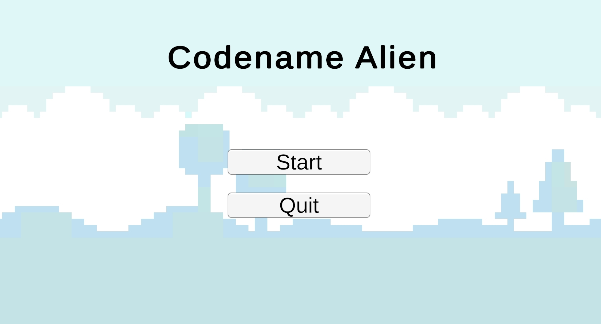
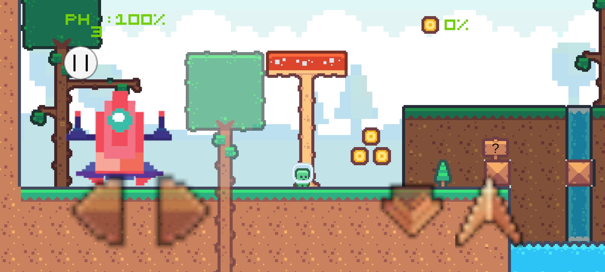
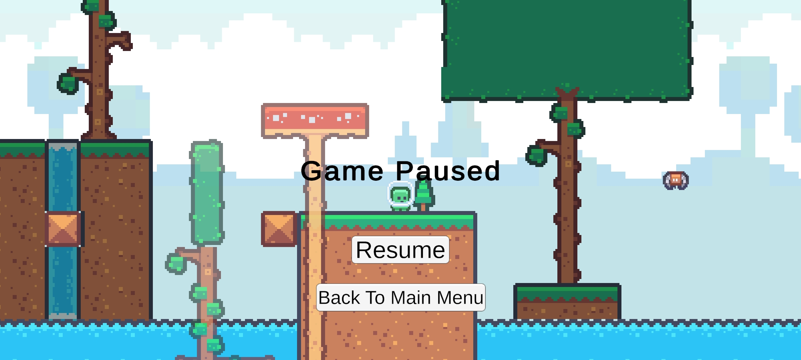
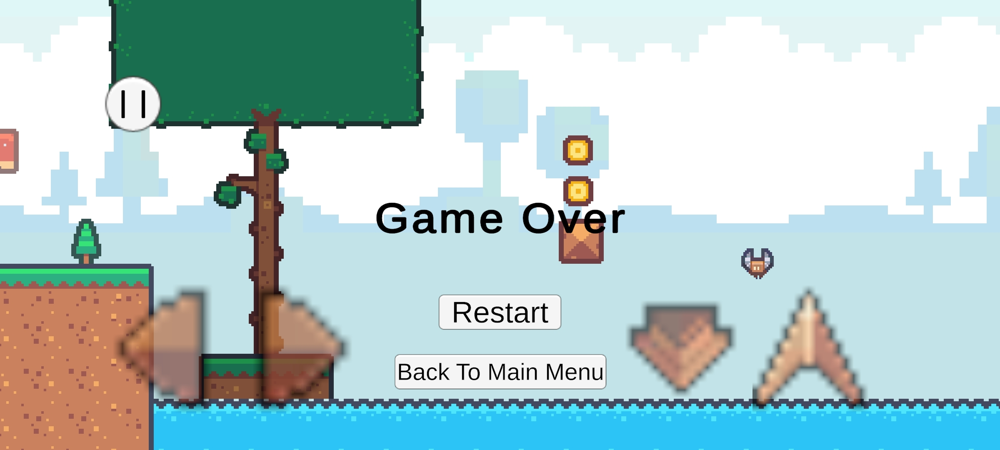

# 👽 Codename: Alien *(working title)*

**Codename: Alien** is a 2D sci-fi platformer where an alien crash-lands on a hostile, uninhabitable planet. With the atmosphere against him and no sign of help, his only chance of survival is to gather essential resources, find his missing spaceship parts, and escape the planet before it's too late.

---

## 🎮 Features

- Smooth player movement with platforming physics  
- Resource collection system  
- Hazardous terrain  
- Level-based progression tied to collecting ship parts    
- UI for health, inventory, etc.
- Retro Style audio and visual effects

- [View Gameplay Docs](Docs/Gameplay.md)

---

## 📌 What's Not Done Yet / TODO

- [ ] Designing Other Levels where Alien Must Find Ship Parts  
- [ ] Implementing Final Boss for Final Level
- [ ] Inventory System  
- [ ] 2D VFX  
- [ ] Polishing The Final Product  

- [View Changelog Here](Docs/Changelog.md)

---

## 🧠 Story Premise

A mysterious alien crash-lands on an alien world that's toxic and unpredictable. With his ship torn apart, he must survive by scavenging for resources while avoiding environmental dangers. The ultimate goal? Escape—before the planet claims another victim.

---

## ⚙️ Tech Stack

- **Engine**: Unity  
- **Language**: C#  
- **Tools**: Visual Studio 2022, Visual Studio Code, Github Desktop, GitKraken, Audacity, Photoshop.  
- **Assets**: [Pixel Platformer - Kenney](https://kenney.nl/assets/pixel-platformer),
- **Audio**: Demo Level Music - [Eric Skiff - A Night Of Dizzy Spells](http://EricSkiff.com/music), Various Other sources like [SoundBible](https://soundbible.com/)

---

## 🕹️ Controls

- **Left Right Arrow Keys / A-D**: Move left and right  
- **Up Arrow Key / W**: Jump  
- **Down Arrow Key / S**: Crouch  
- **Enter / Touch**: Next Dialogue
- **P / (||) Ui Button**: Pause  

---

## 📸 Screenshots / Demo

- 
- 
- 
- 

---

## 🚀 How to Run

1. Clone this repository or download the ZIP.  
2. Open the project in Unity version 6000.0.38f1 or higher (version 6000.0.38f1 is recomended for commits).  
3. Open the `MainMenu` or `SampleScene` scene.  
4. Click Play.

---

## 🧪 Development Approach

This project started as an experimental agile-style solo development journey—where features were added iteratively without rigid planning. Over time, it evolved into a meaningful project worth documenting and polishing for portfolio purposes.

---

## 📜 License

This is a portfolio project under development. All code is open for educational purposes. Assets may be subject to their original licenses.

---

## 🙌 Credits

> [Visit Here to See Credits](Docs/Credits.md)